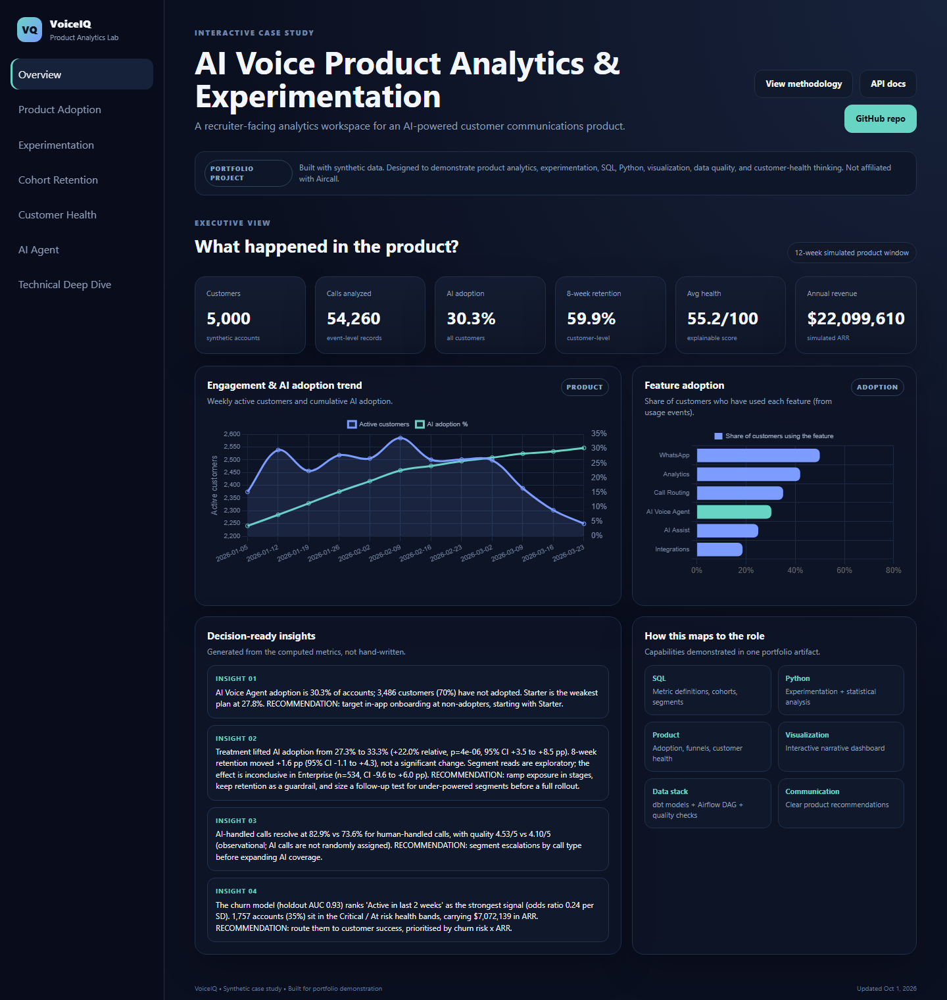
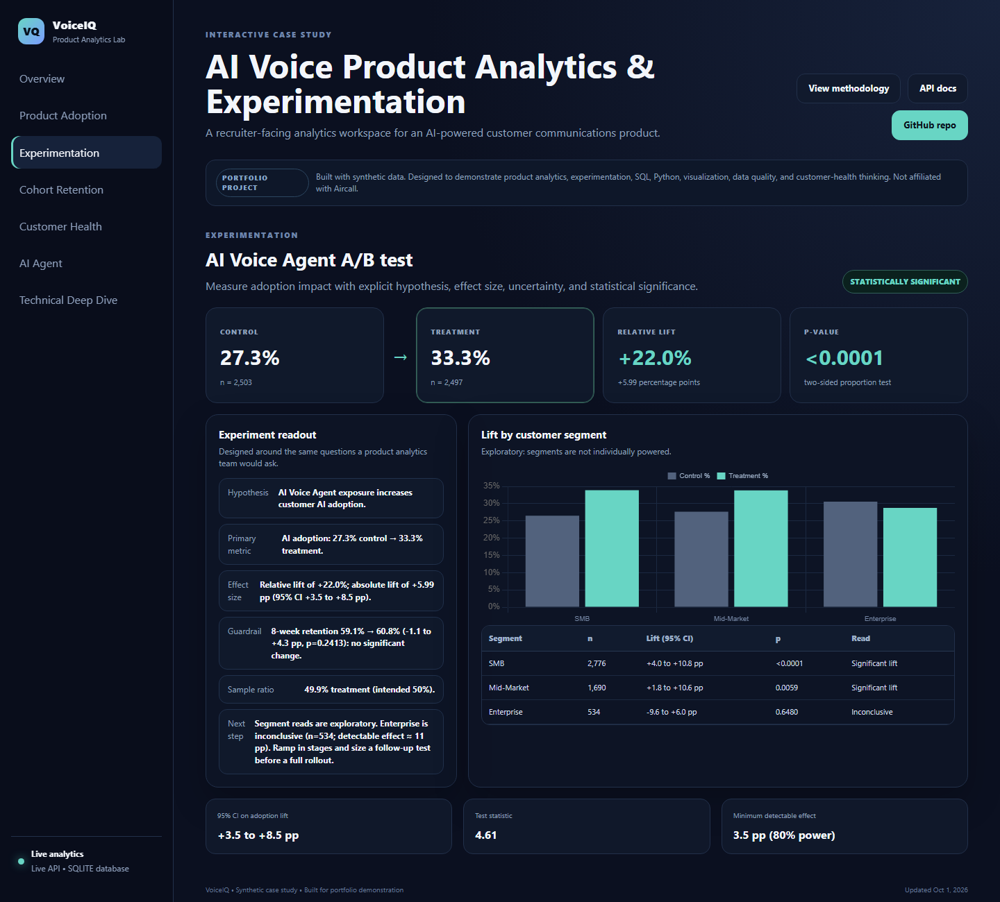
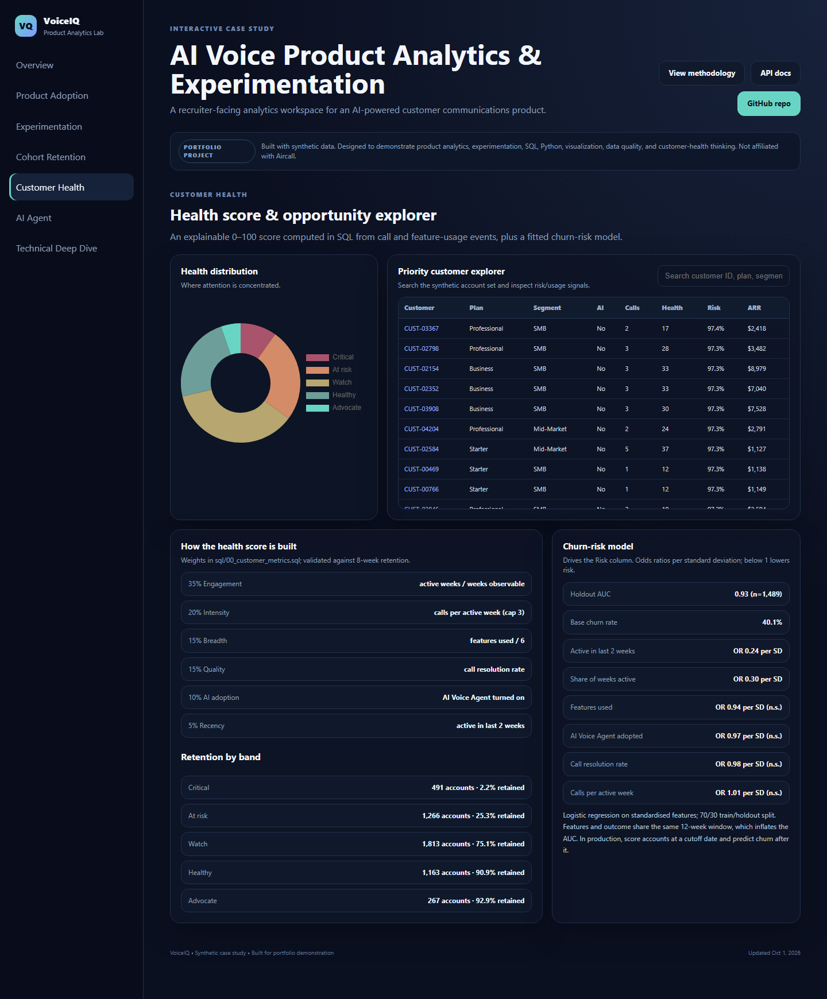

# VoiceIQ — AI Voice Product Analytics & Experimentation

[](https://github.com/ragurajakrishnan15/Product-Analytics/actions/workflows/ci.yml)

**Live dashboard: https://ragurajakrishnan15.github.io/Product-Analytics/**

**Recruiter-facing interactive portfolio project** focused on product analytics for an AI-powered customer communications platform.

> Synthetic case study inspired by the skills described in the Aircall Data Scientist, Product Analytics role. This project is independent and is not affiliated with Aircall or based on proprietary Aircall data.



| Experimentation | Customer health |
|---|---|
|  |  |

## Recruiter first click

> **Note to recruiters & hiring managers:** You do not need to run any code. Open the live link above, or open `site/index.html` locally: it ships with a static snapshot (`site/data/snapshot.js`) so the full dashboard works offline. Only the per-customer call timeline needs the live API.

The dashboard includes:

- Executive KPI view with generated, number-backed insights
- Product adoption analysis with plan/segment filters and a usage funnel
- AI Voice Agent A/B test: lift, confidence intervals, minimum detectable effect, retention guardrail and per-segment reads
- Weekly signup-cohort retention computed from call events
- Explainable health score, a fitted churn-risk model, and an account explorer
- AI vs. human-handled call performance
- Technical deep dive with SQL, Python, dbt, and Airflow examples

## Headline findings

- The treatment lifted AI Voice Agent adoption from 27.3% to 33.3% (+22% relative, p < 0.0001, 95% CI +3.5 to +8.5 pp).
- The lift is significant in SMB and Mid-Market. Enterprise is **inconclusive** (n = 534, CI −9.6 to +6.0 pp): too small to tell, not evidence of harm.
- 8-week retention did not change significantly (+1.6 pp, CI −1.1 to +4.3), so adoption gains should not yet be sold as retention gains.
- Health bands separate outcomes cleanly: 2% of Critical accounts are retained at 8 weeks vs. 93% of Advocates.

## Role-relevant skills demonstrated

| Capability | Evidence |
|---|---|
| SQL | `sql/00_customer_metrics.sql` metric layer, plus adoption, cohort and experiment queries |
| Python | `backend/main.py` (stats + churn model), `analytics/experiment_analysis.py` |
| Product analytics | Adoption, activation, feature usage, cohorts, customer health |
| Experimentation | Hypothesis, effect size, CI, z-test, MDE, guardrail metric, segment heterogeneity |
| Modelling | Logistic-regression churn model with holdout AUC and odds-ratio drivers |
| Visualization | Interactive dashboard in `site/` |
| Data engineering | dbt models + tests, Airflow DAG, data-quality suite, CI |
| Stakeholder communication | Decision-ready insights and recommendations |

## Data model

`build_data.py` generates three raw tables, shaped like what a product actually logs (deterministic, seed 42):

| Table | Rows | Contents |
|---|---|---|
| `data/customers.csv` | 5,000 | Plan, segment, industry, region, signup date, experiment group, ARR, 8-week retention outcome |
| `data/calls.csv` | ~54,000 | One row per call, generated from each account's lifecycle (signup week, weekly activity, churn) |
| `data/feature_usage.csv` | ~10,000 | First-use week per account and feature (6 features, including AI Voice Agent) |

Nothing derived is stored in the raw data. Activity, AI adoption, feature breadth, health score, churn risk and
cohort retention are all computed from these tables:

- **`sql/00_customer_metrics.sql`** builds the customer metric layer, including the health score. The API runs it
  verbatim; `dbt/models/fct_customer_metrics.sql` is the same logic as a dbt model.
- **`backend/main.py`** fits the churn model, runs the experiment statistics, computes cohorts and generates the
  insights. `export_static.py` imports the same functions for the static snapshot, so both modes always agree.

Health score = 35% engagement (active weeks / weeks observable) + 20% intensity (calls per active week, capped at 3)
+ 15% feature breadth + 15% resolution rate + 10% AI adoption + 5% recency.
Bands: Critical < 35, At risk 35–49, Watch 50–64, Healthy 65–79, Advocate ≥ 80.

## Run it

```bash
pip install -r requirements-dev.txt
python build_data.py                                  # raw tables in data/
pytest tests/                                         # data-quality checks + API tests
python export_static.py                               # site/data/snapshot.js + dashboard.json
python -m uvicorn backend.main:app --reload --port 8000
```

Open `http://localhost:8000` for the dashboard and `http://localhost:8000/docs` for the interactive API docs.

The app defaults to SQLite and supports PostgreSQL via `DATABASE_URL`. The database is rebuilt automatically
whenever the raw CSVs or the metric logic change.

API endpoints: `/api/health`, `/api/dashboard` (everything the site needs in one call), `/api/kpis`, `/api/weekly`,
`/api/features`, `/api/experiment`, `/api/cohorts`, `/api/health-distribution`, `/api/churn-model`, `/api/agent`,
`/api/insights`, `/api/customers`, `/api/customers/{customer_id}`, `/api/export/customers.csv`.

## Repository map

```text
├── .github/workflows/            # CI (tests) + GitHub Pages deployment
├── backend/main.py               # FastAPI app: metric layer, stats, churn model, API, static hosting
├── site/                         # interactive dashboard (HTML/CSS/JS + Chart.js)
│   └── data/                     # static snapshot written by export_static.py
├── data/                         # raw synthetic tables
├── sql/                          # metric layer + analytical SQL (00 runs in the API)
├── dbt/                          # staging + fact models with tests (PostgreSQL)
├── airflow/dags/                 # generate -> quality checks -> dbt build -> snapshot export
├── analytics/                    # standalone experiment readout
├── tests/                        # data-quality suite + API tests
├── docs/                         # screenshots
├── build_data.py                 # deterministic dataset generator
└── export_static.py              # writes the static snapshot from the backend code
```

## Deployment

Pushing to `main` runs `.github/workflows/pages.yml`, which rebuilds the snapshot and publishes `site/` to GitHub
Pages. One-time setup: repository **Settings → Pages → Source: GitHub Actions**. Any other static host works too:
point it at `site/` with no build command.

## Limitations (say these in an interview)

- The data is synthetic; effect sizes reflect the generator's assumptions, not a real product.
- The churn model's features and outcome share one 12-week window, which inflates its AUC (0.93). In production,
  score accounts at a cutoff date and predict churn after it.
- Segment results are exploratory: segments were not individually powered (Enterprise MDE ≈ 11 pp).
- AI vs. human call comparisons are observational; AI handling is not randomly assigned.
